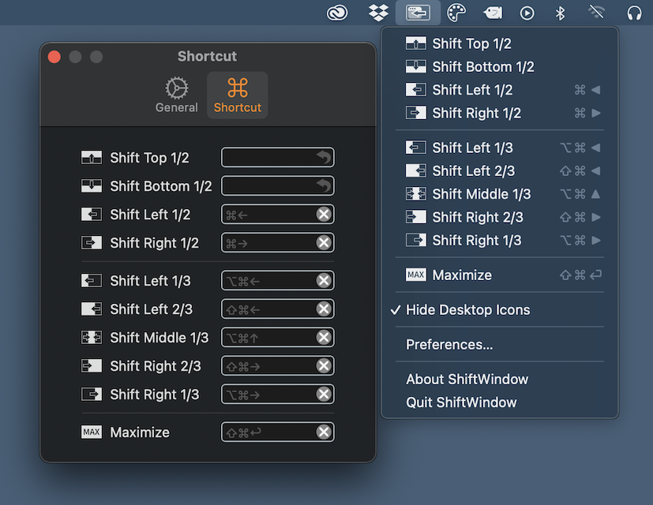

# ShiftWindow

A window arrangement manager for macOS like [BetterSnapTool](https://apps.apple.com/us/app/bettersnaptool/id417375580) and [Magnet](https://apps.apple.com/us/app/magnet/id441258766).
You can split the frontmost window to the left half of the screen, the left two-thirds, etc.

You can also register your favorite keyboard-shortcuts for the command.

## Installation

ShiftWindow ver 1.0 works on macOS 11.0 or later.

1. Download `installer.dmg` from [releases](https://github.com/Kyome22/ShiftWindow/releases) page.
2. Double-click on the `installer.dmg` and open the generated `ShiftWindow Installer`.
3. Copy the App to the Applications folder.
